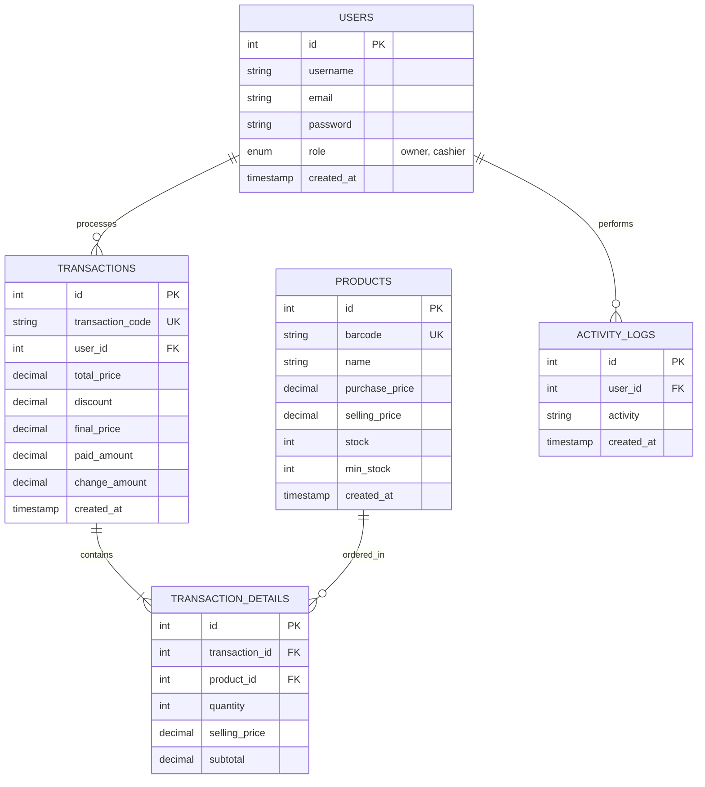

# Project Requirement Document (PRD)
## Sistem Informasi Penjualan & Stok (SIS-TOKO)

---

### Dokumen Kontrol

| Versi | Tanggal | Penulis | Deskripsi Perubahan |
| :--- | :--- | :--- | :--- |
| 1.0 | 7 Juni 2026 | Tim Pengembang Ilmu Komputer | Inisiasi Spesifikasi Teknis Awal |

---

## 1. Ringkasan Proyek

Project **SIS-TOKO** adalah sistem informasi berbasis web yang dirancang khusus untuk menangani proses transaksi penjualan (Point of Sale/POS) serta pengelolaan stok barang (inventaris) secara terintegrasi dan real-time. Sistem ini ditujukan untuk usaha skala mikro, kecil, dan menengah (UMKM) seperti toko kelontong, minimarket, dan cafe.

---

## 2. Arsitektur & Spesifikasi Teknologi

Sistem akan dikembangkan dengan spesifikasi berikut:
*   **Platform:** Web-based Application (Responsive Desktop-first, dioptimalkan untuk resolusi $\ge$ 1366x768).
*   **Backend & Frontend:** PHP (Native/Laravel) / Javascript (SPA/MPA) sesuai preferensi implementasi tim.
*   **Database:** MariaDB (v10.11).
*   **Deployment:** Docker-ready (menggunakan Docker Compose yang telah dikonfigurasi dengan Nginx, PHP, dan Database).

---

## 3. Spesifikasi Kebutuhan Fungsional

### 3.1 Fitur Berdasarkan Peran Pengguna (Role-based Features)

#### A. Peran: Kasir (Cashier)

| ID | Fitur | Deskripsi Teknis |
| :--- | :--- | :--- |
| **F1** | Login Sederhana | Autentikasi menggunakan Username/Email dan Password. Kasir diarahkan langsung ke halaman transaksi dan dibatasi aksesnya agar tidak bisa mengakses menu manajemen stok/master data dan laporan keuangan. |
| **F2** | Scan/Input Kode Barang | Input pencarian barang di kasir mendukung: 1. Input teks manual (pencarian nama barang atau kode barcode). 2. Pemindaian kode barcode menggunakan barcode scanner fisik (menangkap input keyboard otomatis). |
| **F3** | Manajemen Keranjang Belanja | Menyajikan tabel daftar barang belanjaan aktif yang mencakup: - Nama Barang & Kode/Barcode. - Harga Satuan. - Jumlah (*Quantity*) dengan tombol tambah/kurang instan. - Subtotal per baris. - Tombol hapus item dari keranjang. |
| **F4** | Kalkulator Total & Diskon | Menghitung total belanjaan secara otomatis. Mendukung skema input diskon: - Diskon persentase (%). - Diskon nominal tetap (Rupiah). Menghitung sisa kembalian berdasarkan jumlah uang tunai yang diinput oleh kasir. |
| **F5** | Cetak Struk (PDF/Thermal) | Setelah transaksi sukses disimpan ke database: - Sistem memunculkan dialog cetak struk otomatis. - Struk diformat ramah printer thermal (lebar 58mm atau 80mm) atau disimpan sebagai PDF. |
| **F6** | Logout | Menghapus sesi kasir dengan aman dan mengarahkan kembali ke halaman login. |

#### B. Peran: Pemilik Toko (Owner)

| ID | Fitur | Deskripsi Teknis |
| :--- | :--- | :--- |
| **F7** | Dashboard Stok Real-Time | Halaman utama pemilik untuk memantau ringkasan bisnis: - Total variasi produk. - Nilai aset inventaris (modal vs harga jual). - Grafik/Tabel stok kritis (barang yang hampir habis). |
| **F8** | CRUD Master Data Barang | Halaman manajemen barang: - Tambah barang baru (Kode/Barcode unik, Nama Barang, Kategori, Harga Beli, Harga Jual, Stok Awal, Batas Minimum Stok). - Edit detail barang dan hapus barang (soft delete direkomendasikan agar histori transaksi tidak rusak). |
| **F9** | Histori Transaksi Penjualan | Log detail seluruh transaksi penjualan yang telah terjadi. Dilengkapi filter pencarian berdasarkan rentang tanggal, nama kasir, dan ID transaksi. |
| **F10** | Laporan Penjualan & Grafik | Visualisasi performa penjualan dalam bentuk grafik (bar chart/line chart) dan tabel ringkasan: - Total pendapatan kotor & bersih (keuntungan). - Barang paling laris (*best seller*). - Ekspor laporan ke format Excel (CSV) dan PDF. |
| **F11** | Sistem Peringatan Stok Minim | Notifikasi visual (badge warna merah/kuning) pada dashboard dan daftar barang jika stok barang < Batas Minimum Stok. |
| **F12** | Manajemen Akun Kasir | CRUD data akun kasir. Pemilik dapat membuatkan akun baru untuk kasir, mengubah kata sandi kasir, dan menonaktifkan akun kasir. |

#### C. Fitur Otomatis (System/Backend Tasks)

| ID | Fitur | Deskripsi Teknis |
| :--- | :--- | :--- |
| **F13** | Pemotongan Stok Otomatis | Setiap transaksi penjualan yang berstatus *Success* secara otomatis mengurangi kuantitas stok barang di tabel database menggunakan database transaction (ACID) untuk mencegah *race condition*. |
| **F14** | Log Aktivitas & Keamanan | Sistem mencatat log aktivitas penting (siapa, kapan, aksi apa) untuk audit trail, seperti manipulasi stok atau pembatalan transaksi. |
| **F15** | Backup Database | Script otomatis/cron job untuk mengekspor database (mysqldump) secara berkala setiap hari dan disimpan di folder backup lokal atau cloud storage. |

---

## 4. Skema Database Konseptual (Entity Relationship)

Berikut adalah rancangan tabel database minimal yang diperlukan untuk mendukung sistem:

---

## 5. Kebutuhan Non-Fungsional (Non-Functional Requirements)

| ID | Parameter | Kriteria Sukses (Target) |
| :--- | :--- | :--- |
| **NF1** | Kecepatan Transaksi | Pemrosesan checkout dan pemotongan stok pada database harus diselesaikan dalam waktu **< 2 detik** per klik tombol bayar. |
| **NF2** | Waktu Muat Halaman | Halaman utama kasir dan dashboard pemilik harus termuat penuh dalam waktu **< 3 detik** pada koneksi internet seluler standar (3G/4G). |
| **NF3** | Keamanan Data | - Kata sandi pengguna wajib di-hash menggunakan algoritma aman (misalnya: Bcrypt / Argon2). - Terapkan otorisasi berbasis peran (Role-Based Access Control / RBAC) di sisi backend agar rute/endpoint pemilik tidak bisa ditembus oleh kasir melalui modifikasi URL browser. |
| **NF4** | Ketersediaan Sistem | Ketersediaan sistem ditargetkan **99% uptime** di luar jadwal pemeliharaan (maintenance) server yang diumumkan sebelumnya. |
| **NF5** | Kompatibilitas Perangkat | Responsif di browser desktop/laptop modern (Google Chrome, Mozilla Firefox, Safari, Microsoft Edge) dengan resolusi minimum **1366x768**. |

---

## 6. Manajemen Risiko & Mitigasi

| ID | Skenario Risiko | Dampak | Strategi Mitigasi |
| :--- | :--- | :--- | :--- |
| **R1** | Kasir mengalami kesulitan mengoperasikan antarmuka web. | Rendah | Mendesain antarmuka kasir secara minimalis, minim klik, tombol navigasi besar, dan mendukung shortcut keyboard (misal: tombol `F8` untuk bayar). |
| **R2** | Koneksi internet toko terputus di tengah jam operasional. | Tinggi | Menyediakan skema penyimpanan keranjang belanja sementara menggunakan browser *Local Storage* agar data tidak hilang ketika halaman tidak sengaja termuat ulang sebelum koneksi pulih. |
| **R3** | Ketidaksesuaian stok fisik dengan data sistem. | Sedang | Pemilik wajib difasilitasi fitur input penyesuaian stok (stock opname) secara berkala dan sistem mencatat setiap riwayat penyesuaian tersebut. |
| **R4** | Kehilangan data akibat kerusakan server hosting. | Rendah | Mengaktifkan backup database terjadwal secara otomatis (*cron job*) ke penyimpanan terpisah secara teratur. |
